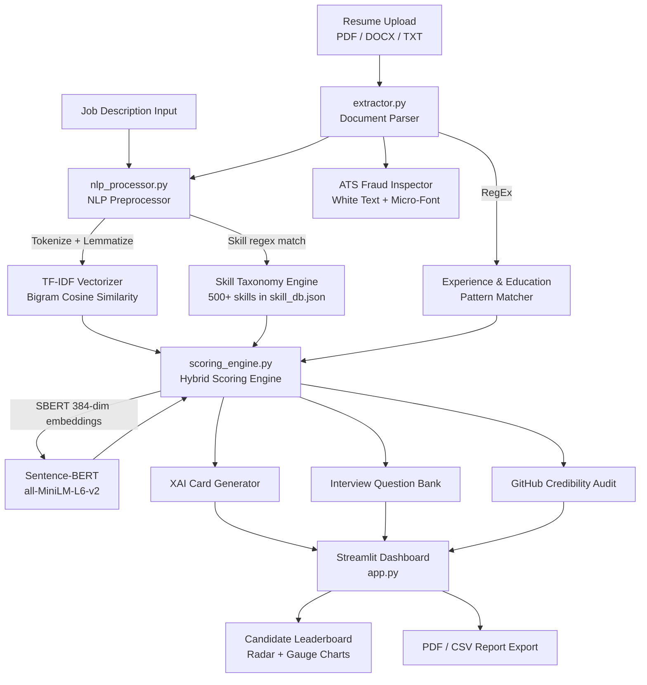

# AI Resume Screening & Candidate Ranking System
> **B.Tech Final Year Major Project (2025–26)**  
> Computer Science & Engineering | 8th Semester  
> *Built with Python · Streamlit · Scikit-Learn · NLTK · Sentence-BERT · Plotly · ReportLab*

---

## 1. Problem Statement

Manual resume screening is one of the most time-consuming and bias-prone steps in modern recruitment. A typical recruiter spends **6–8 seconds** per resume, leading to:

- High error rate in candidate shortlisting
- Unconscious bias (name, institution, format preference)
- Inability to process hundreds of applications within deadlines
- No explainability — candidates are rejected with zero feedback

This project proposes an **NLP-powered automated screening system** that evaluates resumes against a Job Description (JD) using a multi-factor hybrid scoring engine, provides ranked leaderboards with explainable AI justifications, and reduces screening time by over **80%**.

---

## 2. Project Objectives

1. Build a multi-format resume parser (PDF, DOCX, TXT) with fallback handling for corrupt/scanned files
2. Implement a **hybrid NLP scoring engine** combining Sentence-BERT semantic similarity + TF-IDF keyword matching + skill overlap + experience analysis
3. Detect ATS-cheating tricks (white/invisible text, micro-fonts) automatically
4. Generate downloadable recruiter reports (PDF + CSV)
5. Provide a **Candidate Copilot** mode — ATS audit, cover letter generator, and interview prep
6. Keep the system interpretable via an **Explainable AI (XAI) justification card** for each candidate

---

## 3. System Architecture



---

## 4. Algorithm Flowchart Explanation

### 4.1 Text Extraction Pipeline

```
Resume File
    │
    ├─ PDF?   → pdfplumber.open() → extract_text() per page
    │               └── if empty → PdfReader (pypdf) fallback
    │                       └── if still empty → warn user (likely scanned image)
    │
    ├─ DOCX?  → python-docx: paragraphs + table cells
    │
    └─ TXT?   → direct read with UTF-8 decode
```

### 4.2 NLP Preprocessing (`nlp_processor.py`)

```
Raw Text
  │
  ├─ 1. normalize_text()
  │       ├── lowercase
  │       ├── strip URLs, emails, handles, hashtags
  │       └── collapse whitespace
  │
  ├─ 2. word_tokenize() [NLTK punkt]
  │       └── fallback: simple split() if punkt unavailable
  │
  ├─ 3. Remove NLTK stopwords
  │
  └─ 4. WordNetLemmatizer.lemmatize()
          └── Output: clean token string → TF-IDF input
```

### 4.3 Hybrid Scoring Formula

The final candidate score is a weighted linear combination:

$$\text{Final Score} = w_1 \cdot S_{SBERT} + w_2 \cdot S_{TF\text{-}IDF} + w_3 \cdot S_{Skills} + w_4 \cdot S_{Exp}$$

| Component | Default Weight | What it measures |
|---|---|---|
| $S_{SBERT}$ | 35% | Semantic meaning alignment (deep NLP) |
| $S_{TF\text{-}IDF}$ | 25% | Keyword/phrase overlap (surface NLP) |
| $S_{Skills}$ | 30% | Hard skills present in resume vs JD |
| $S_{Exp}$ | 10% | Work experience years vs requirement |

> **Weights are fully adjustable** from the sidebar sliders at runtime and normalized to sum to 1.0.

### 4.4 ATS Fraud Detection

```
PDF Character Stream (pdfplumber)
    │
    ├─ For each char:
    │     ├─ non_stroking_color: is RGB value ≥ [0.95, 0.95, 0.95]?
    │     │       → WHITE / INVISIBLE TEXT DETECTED
    │     │
    │     └─ font size ≤ 2.5pt?
    │             → MICRO-FONT DETECTED
    │
    └─ If any detected → fraud_detected = True, show warning in UI
```

---

## 5. Repository Structure

```
AI-RESUME SCREENING SYSTEM/
│
├── app.py                      # Streamlit main entry point
├── requirements.txt            # pip dependencies
├── README.md                   # This file
│
├── modules/                    # Backend NLP & scoring core
│   ├── extractor.py            # PDF/DOCX parsing, contact/edu/exp extraction, ATS fraud
│   ├── nlp_processor.py        # Text normalization, TF-IDF preprocessing, skill extraction
│   ├── scoring_engine.py       # Hybrid score engine: SBERT + TF-IDF + skills + XAI
│   ├── ats_analyzer.py         # ATS score calculator — section, keyword, word-count audit
│   ├── career_advisor.py       # Cover letter, job title recommendations, mock questions
│   ├── github_verifier.py      # GitHub API credibility check
│   └── report_generator.py     # ReportLab PDF + Pandas CSV export
│
├── components/                 # UI components
│   ├── custom_css.py           # Glassmorphism dark theme CSS injection
│   ├── visualizations.py       # Plotly radar, gauge, bar, skill-gap charts
│   └── chatbot.py              # AI Copilot sidebar chatbot (context-aware)
│
└── data/
    ├── skill_db.json           # 500+ skills across 6 technical categories
    ├── sample_jds.json         # Preset JDs: SDE, ML Engineer, DevOps, Data Analyst
    └── sample_resumes/         # .txt sample resumes for instant demo
```

---

## 6. Setup & Installation

### Prerequisites
- Python **3.9+**
- pip package manager

### Step 1 — Clone / Open Project
```bash
cd "AI-RESUME SCREENING SYSTEM"
```

### Step 2 — Create Virtual Environment (recommended)
```bash
python -m venv venv
venv\Scripts\activate        # Windows
# source venv/bin/activate   # Linux/Mac
```

### Step 3 — Install Dependencies
```bash
pip install -r requirements.txt
```

### Step 4 — Run the Application
```bash
streamlit run app.py
```

Opens at **http://localhost:8501** in your browser.

### Step 5 — Demo Without Setup (Instant)
1. Select **"Sample Dataset"** as resume source in Recruiter Suite
2. Select any **"Preset Role"** as the job description
3. Click **"Run Candidate Screening"** — no file uploads needed

---

## 7. Key Modules — Technical Details

### `nlp_processor.py`
- `normalize_text()` — strips URLs, handles, hashtags, punctuation; lowercases
- `preprocess_for_tfidf()` — full pipeline: normalize → tokenize → stopword filter → lemmatize
- `extract_skills()` — regex `\b<skill>\b` scan against 500+ skill taxonomy
- `compute_keyword_density()` — used by ATS score calculator for keyword gap penalty

### `scoring_engine.py`
- `compute_tfidf_score()` — `TfidfVectorizer(ngram_range=(1,2), sublinear_tf=True)` → cosine similarity
- `compute_sbert_score()` — `all-MiniLM-L6-v2` 384-dim embeddings → `util.cos_sim()`; falls back to TF-IDF if model unavailable
- `build_xai_card()` — generates positive contributors, deductions, and natural language verdict
- `analyze_candidate()` — orchestrates all steps; returns structured result dict for UI

### `extractor.py`
- `_parse_pdf()` — pdfplumber primary, pypdf fallback; returns `""` for scanned images
- `detect_ats_fraud()` — inspects char-level PDF metadata for white text and micro-fonts
- `extract_experience_years()` — two strategies: "X years of experience" regex + job date range scan

---

## 8. Theoretical Background

### TF-IDF (Term Frequency – Inverse Document Frequency)

Assigns higher weight to rare, domain-specific terms (e.g. "Kubernetes", "PyTorch") and penalizes common filler words ("experience", "worked"):

$$\text{TF-IDF}(t, d) = \log(1 + f_{t,d}) \times \log\!\left(\frac{|D|}{1 + df_t}\right)$$

Why not just keyword count? Because "Python" appearing 20 times should not be 20× more impactful than appearing once. `sublinear_tf=True` handles this with log dampening.

### Cosine Similarity

Measures angular distance between two TF-IDF vectors — independent of document length:

$$\text{cos}(\vec{A}, \vec{B}) = \frac{\vec{A} \cdot \vec{B}}{\|\vec{A}\| \|\vec{B}\|}$$

Range: 0.0 (completely dissimilar) → 1.0 (identical). Multiplied by 100 to give a percentage score.

### Sentence-BERT (SBERT)

Unlike TF-IDF, SBERT understands semantic equivalence — "develop REST services" and "build web APIs" score high similarity even with no word overlap. Uses the `all-MiniLM-L6-v2` model (22M parameters, 384-dim embeddings). Input text truncated to 2000 characters (~512 tokens).

---

## 9. Viva Voce Q&A Reference

| Question | Answer |
|---|---|
| **Why use both SBERT and TF-IDF?** | SBERT captures semantic meaning but can miss exact technical keywords. TF-IDF weights specific tech terms highly. The hybrid score gets the best of both. |
| **What happens if SBERT model isn't available?** | `_load_sbert()` returns `False` and `compute_sbert_score()` transparently falls back to `compute_tfidf_score()`. The app never crashes. |
| **How is the skill taxonomy built?** | Manually curated `skill_db.json` with 500+ skills across 6 categories. Each skill is matched using `\b<skill>\b` word-boundary regex to avoid false positives (e.g. "R" matching inside "React"). |
| **How do you detect ATS fraud?** | pdfplumber exposes character-level metadata. We check `non_stroking_color` for near-white RGB values and `size` for < 2.5pt fonts — both invisible to human readers but parsed by ATS bots. |
| **Why `sublinear_tf=True` in TF-IDF?** | Prevents very frequent terms from dominating the score. `log(1 + tf)` instead of raw `tf` dampens the effect of repeated terms. |
| **What is the weight normalization logic?** | Sidebar slider values may not sum to 1.0. We divide each weight by the total sum before scoring so the formula always stays valid. |

---

## 10. Future Enhancements

- [ ] **OCR Integration** — add `pytesseract` fallback for scanned image PDFs (currently return empty text)
- [ ] **spaCy NER** — use Named Entity Recognition to extract company names, job titles, and institutions more accurately than regex
- [ ] **Bias Audit Layer** — flag when scoring patterns show statistical correlation with institution/location (demographic parity check)
- [ ] **Multi-language Support** — support Hindi and regional language resumes using multilingual SBERT variants
- [ ] **Resume Re-ranker** — use a cross-encoder model (BERT-based) as a second-pass re-ranker on top of the bi-encoder SBERT scores
- [ ] **Database Backend** — migrate from session_state to SQLite/PostgreSQL for persistent candidate records across sessions
- [ ] **Skill Gap Learning Roadmap** — auto-generate a week-by-week learning plan for missing skills using course APIs (Coursera, NPTEL)

---

## 11. Dependencies (`requirements.txt`)

| Package | Purpose |
|---|---|
| `streamlit` | Web UI framework |
| `pdfplumber` | PDF text + metadata extraction |
| `pypdf` | PDF fallback parser |
| `python-docx` | DOCX parsing |
| `scikit-learn` | TF-IDF vectorizer + cosine similarity |
| `nltk` | Tokenization, stopwords, lemmatizer |
| `sentence-transformers` | SBERT semantic embeddings |
| `plotly` | Interactive charts (radar, gauge, bar) |
| `pandas` | DataFrame operations + CSV export |
| `reportlab` | PDF scorecard generation |
| `numpy` | Numeric operations |
| `requests` | GitHub API calls |

---

*Project developed as part of B.Tech CSE 8th Semester Major Project — Academic Year 2025–26*
