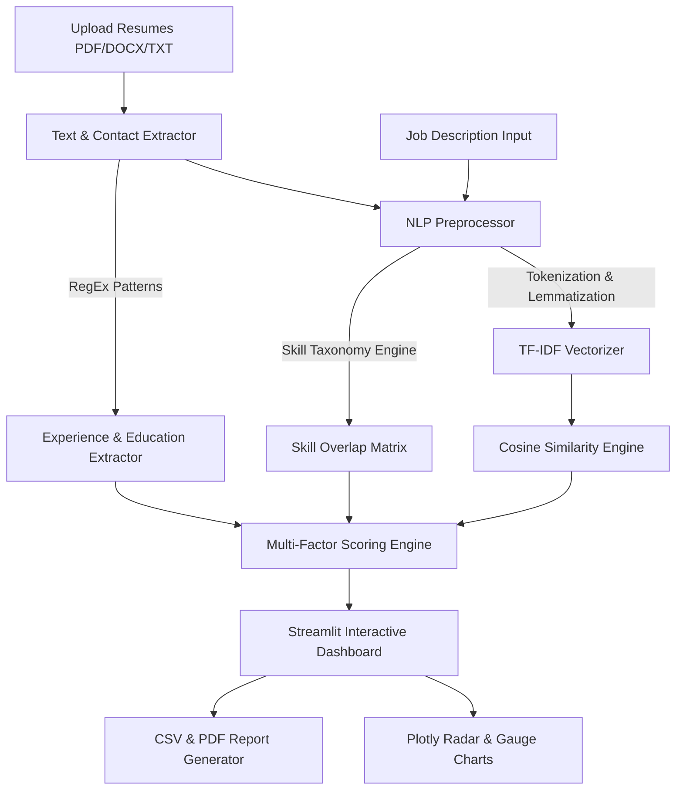

# 📄 AI-Resume Screening & Candidate Ranking System
> **B.Tech 4th-Year Major Project** | Computer Science & Engineering  
> *Built with Python, Streamlit, Scikit-Learn, NLTK, Plotly, and ReportLab*

---

## 📌 Executive Summary / Abstract

The **AI-Resume Screening System** is an intelligent automated platform designed to solve the inefficiency of manual resume filtering in recruitment workflows. Using advanced **Natural Language Processing (NLP)**, **TF-IDF Vectorization**, **Cosine Similarity**, and a **500+ Skill Taxonomy Database**, this system parses candidate resumes (PDF, DOCX, TXT), extracts structural entities (Contact Info, Experience, Education, Technical Skills), and scores candidate relevance against target Job Descriptions (JDs).

It features **dual application modes**:
1. **🏢 HR Recruiter Batch Mode**: Evaluates multiple candidate resumes simultaneously, ranks candidates on a leaderboard, provides visual analytics (Radar charts, factor breakdown, score gauges), and exports evaluation reports in PDF/CSV formats.
2. **👨‍🎓 Student ATS Analyzer Mode**: Audits individual resumes against ATS (Applicant Tracking System) standards, detects missing keywords, and gives actionable recommendations to increase resume visibility.

---

## ✨ Key Features

- **📄 Multi-Format Parser**: Supports PDF (`pdfplumber` / `pypdf`), DOCX (`python-docx`), and plain text parsing.
- **🧮 Explainable AI Multi-Factor Scoring**:
  $$\text{Final Score} = w_1 S_{\text{TF-IDF}} + w_2 S_{\text{HardSkill}} + w_3 S_{\text{Experience}} + w_4 S_{\text{Education}}$$
- **🎯 500+ Skill Taxonomy Matcher**: Categorized into Programming Languages, Web Frameworks, Data Science & AI, Databases, Cloud & DevOps, CS Core, and Soft Skills.
- **📊 Interactive Visualizations**: Plotly skill radar charts, similarity gauge meters, factor score breakdown bar graphs, and candidate leaderboards.
- **📥 One-Click Evaluation Reports**: Generate downloadable recruiter summary CSVs and detailed candidate PDF scorecards.
- **⚡ Pre-Loaded Demo Dataset**: Includes sample resumes and job roles for instant demonstration to project evaluators without manual data entry.

---

## 🏗️ System Architecture



---

## 📁 Repository Structure

```
AI-RESUME SCREENING SYSTEM/
│
├── app.py                      # Main Streamlit Web Application Dashboard
├── requirements.txt            # Python Dependencies
├── README.md                   # B.Tech Academic Project Documentation
│
├── modules/                    # Backend Logic & NLP Processing Core
│   ├── __init__.py
│   ├── extractor.py            # PDF/DOCX Parsing & RegEx Contact/Experience Extractor
│   ├── nlp_processor.py        # Text Preprocessing, Lemmatization & Skill Matcher
│   ├── scoring_engine.py       # TF-IDF, Cosine Similarity & Multi-Factor Scoring
│   ├── ats_analyzer.py         # ATS Readability Audit & Keyword Gap Analysis
│   └── report_generator.py    # ReportLab PDF & Pandas CSV Export Generators
│
├── components/                 # UI & Visual Analytics Components
│   ├── __init__.py
│   ├── custom_css.py           # Modern Dark Glassmorphism CSS Theme
│   └── visualizations.py       # Plotly Radar, Gauge, and Leaderboard Charts
│
└── data/                       # Taxonomy Database & Demo Datasets
    ├── skill_db.json           # Categorized 500+ Technical & Soft Skills Database
    ├── sample_jds.json         # Pre-configured Job Descriptions (SDE, Data Science, DevOps, AI)
    └── sample_resumes/         # Sample Candidate Resumes (.txt format)
```

---

## 🚀 Installation & Running Guide

### 1. Prerequisites
Ensure Python **3.9+** is installed on your system.

### 2. Install Dependencies
Open terminal/command prompt in the project root directory and run:
```bash
pip install -r requirements.txt
```

### 3. Launch Application
Start the Streamlit dashboard:
```bash
streamlit run app.py
```

The application will launch automatically in your browser at `http://localhost:8501`.

---

## 🧮 Theoretical Background & Algorithms

### 1. TF-IDF (Term Frequency - Inverse Document Frequency)
TF-IDF quantifies word importance in a document relative to a corpus:

$$\text{TF}(t, d) = \frac{f_{t,d}}{\sum_{t' \in d} f_{t',d}}$$

$$\text{IDF}(t, D) = \log \left( \frac{|D|}{1 + |\{d \in D : t \in d\}|} \right)$$

$$\text{TF-IDF}(t, d, D) = \text{TF}(t, d) \times \text{IDF}(t, D)$$

### 2. Cosine Similarity
Calculates the angular similarity between the resume vector ($\vec{A}$) and job description vector ($\vec{B}$):

$$\text{Cosine Similarity}(\vec{A}, \vec{B}) = \frac{\vec{A} \cdot \vec{B}}{\|\vec{A}\| \|\vec{B}\|} = \frac{\sum_{i=1}^{n} A_i B_i}{\sqrt{\sum_{i=1}^{n} A_i^2} \sqrt{\sum_{i=1}^{n} B_i^2}}$$

---

## 🎓 Viva Voce Preparation Guide (Q&A)

| Question | Answer |
|---|---|
| **What problem does this project solve?** | Reduces recruiter resume screening time by over 80% through automated NLP scoring and skill gap visualization. |
| **Why TF-IDF instead of simple keyword matching?** | Simple matching treats all words equally. TF-IDF down-weights common non-discriminative words ('experience', 'worked') and assigns higher weights to rare domain terms ('Kubernetes', 'PyTorch'). |
| **How does Cosine Similarity evaluate text?** | Converts text into high-dimensional vector space weighted by TF-IDF. The cosine of the angle between vectors gives a normalized metric between 0.0 (completely dissimilar) and 1.0 (identical match). |
| **How are skills extracted from unstructured text?** | Using regular expression boundary matching (`\b<skill>\b`) cross-referenced against a pre-compiled taxonomy of 500+ technical skills in `skill_db.json`. |
